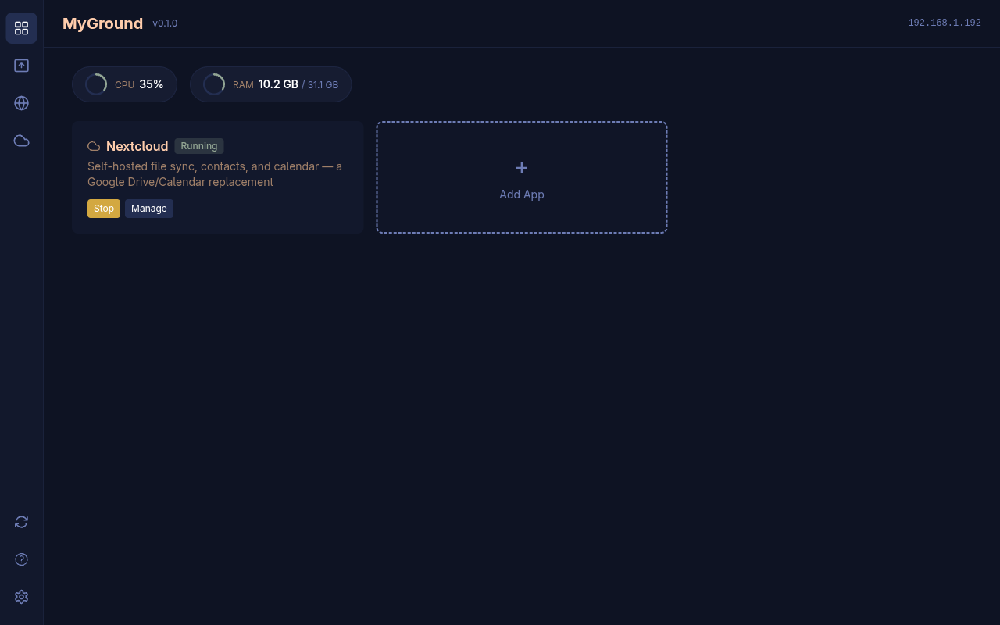

<p align="center">
  
</p>

<h3 align="center">MyGround</h3>
<p align="center">Self-hosting platform — hold your ground</p>

<p align="center">
  <a href="https://github.com/backmeupplz/myground/releases/latest"></a>
  <a href="LICENSE"></a>
</p>

<p align="center">
  
</p>

---

MyGround lets you self-host apps on your own hardware with a single command. It handles Docker orchestration, Tailscale/Cloudflare networking, encrypted backups, and GPU passthrough — so you don't have to.

## Apps

| App | Replaces | Highlights |
|-----|----------|------------|
| **Immich** | Google Photos | Photo/video management, ML, GPU support, DB backup |
| **Nextcloud** | Google Drive/Calendar | File sync, contacts, calendar, DB backup |
| **Jellyfin** | Netflix/Plex | Media streaming, GPU transcoding |
| **Navidrome** | Spotify (library) | Music server, Subsonic-compatible |
| **Vaultwarden** | Bitwarden | Password manager |
| **Pi-hole** | — | Network-wide ad blocking & DNS |
| **Beszel** | — | Server monitoring & alerts |
| **qBittorrent** | — | Torrent client with web UI |
| **Memos** | Google Keep | Lightweight note-taking |
| **File Browser** | — | Web-based file manager |

## Features

- **One-command app install** — deploy any app with `myground app install <name>`
- **Encrypted backups** — scheduled Restic backups with restore, including database dump/restore
- **Tailscale & Cloudflare** — expose apps via Tailscale Funnel or Cloudflare Tunnel
- **GPU passthrough** — automatic GPU detection for Immich ML and Jellyfin transcoding
- **Web dashboard** — manage apps, backups, and settings from your browser
- **CLI + REST API** — full control from terminal or scripts ([API docs](https://myground.online/docs.html))
- **Auto-updates** — keep apps up to date automatically

## Install

```bash
curl -fsSL https://myground.online/install.sh | sh
```

Or via package manager:

```bash
# Homebrew
brew install backmeupplz/tap/myground

# Arch (AUR)
yay -S myground-bin

# Debian/Ubuntu (.deb)
# See https://myground.online/docs.html
```

## Links

[**Docs**](https://myground.online/docs.html) · [**API**](https://myground.online/docs.html) · [**Discord**](https://discord.gg/7fNjZEFrh6) · [**License**](LICENSE)
